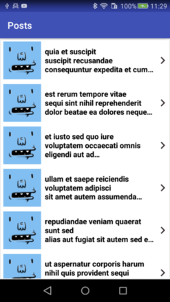
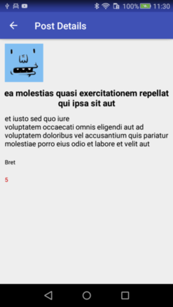

## Dummy Posts

Technical project for the position of Android developer in Babylon Health.

## Description

**Babylon Posts** is a simple app that receives posts from a [posts api](http://jsonplaceholder.typicode.com/posts) and display them to a list. Also the post user avatar is shown based on the data received from the corresponding [users endpoint](http://jsonplaceholder.typicode.com/users). When user taps on a post, the details of this post are shown, including it's title, text and comments number, last received from [comments api](http://jsonplaceholder.typicode.com/comments).

## Screenshots

## Architecture
The project architecture is based on the MVP pattern. More specifically, the code structure is separated in three layers :

* **Model:** This layer is responsible for managing data. In this app this layer communicates/interacts with external resources (Network, databases etc) to serve the requested data. 
* **Presenter:** This layer is responsible to interacts to all views requests, querying the Model layer and updating the coresponding view, acording to the data provided by model
* **View:** This layer is responsible to present the data as decided by the presenter and querying the presenter when it needs to be updated.

More info about this architecture may be found [here](https://antonioleiva.com/mvp-android/)

## Libraries used
* **Dagger 2**
* **Retrofit**
* **Picasso**
* **ButterKnife**
* **Room**
* **RxJava 2**
* **RxAndroid**
* **Mockito**

## IDE
Developed in Android studio 3.0 using Gradle 3.0.0

## Developed by
Antonis Latas (latas.ceid@gmail.com) in terms of Babylon Health, Android developer test project
